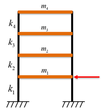
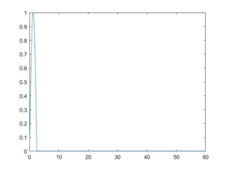
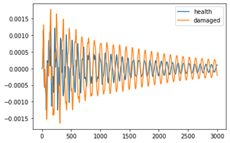
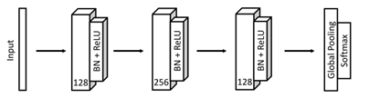

# Structural Damage Detection (SDD) using FCN

> this project is based on [tsai](https://github.com/timeseriesAI/tsai/tree/main/tutorial_nbs)

This project tries to detect structural damages (stiffness reduce) of a four floor frame

## Project tree

>frame_data - matlab codes for data generation
>
>frame_test.ipynb - Colab file for training and testing
>
>For data to train FCN, please run matlab codes data_generation.m in frame_data folder.

## Simulation

The four floor frame used is as the follow:

Force was applied to the first floor using a half-sine wave with the period of 5.0sec, and the maximum force is 100N.

Time histories analysis was implemented using newmark's $\beta$ method according to [Modal Time History Analysis of Structures](https://www.mathworks.com/matlabcentral/fileexchange/30866-modal-time-history-analysis-of-structures)by [Tazarv](https://www.mathworks.com/matlabcentral/profile/authors/2801335) et al. One of results is as folows:

## FCN

FCN is used to do the task of structural damage detection, which, in fact, is a multi-label classification problem based on time series. The artitecture of FCN is as follows according to  [Fawaz et al](https://link.springer.com/article/10.1007/s10618-019-00619-1)

